# Hardware Photos

Macro photos from the Unit 1 teardown, selected for readable chip markings and
connector/antenna detail. See [README.md](README.md) for the story and
[TECHNICAL_DEEP_DIVE.md](TECHNICAL_DEEP_DIVE.md) for the full engineering notes.

Factory QC labels and QR-code stickers visible in the raw photos have been
blacked out — they carry a per-unit serial and aren't needed to follow the RE
work.

## Board overview

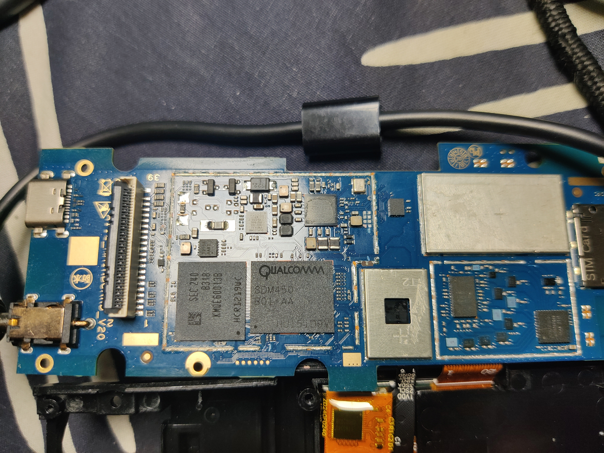
**Front, full board.** USB-C, SIM tray, GNSS shield, and the SDM450/PMI632 RF-shield
can all be seen in one frame.

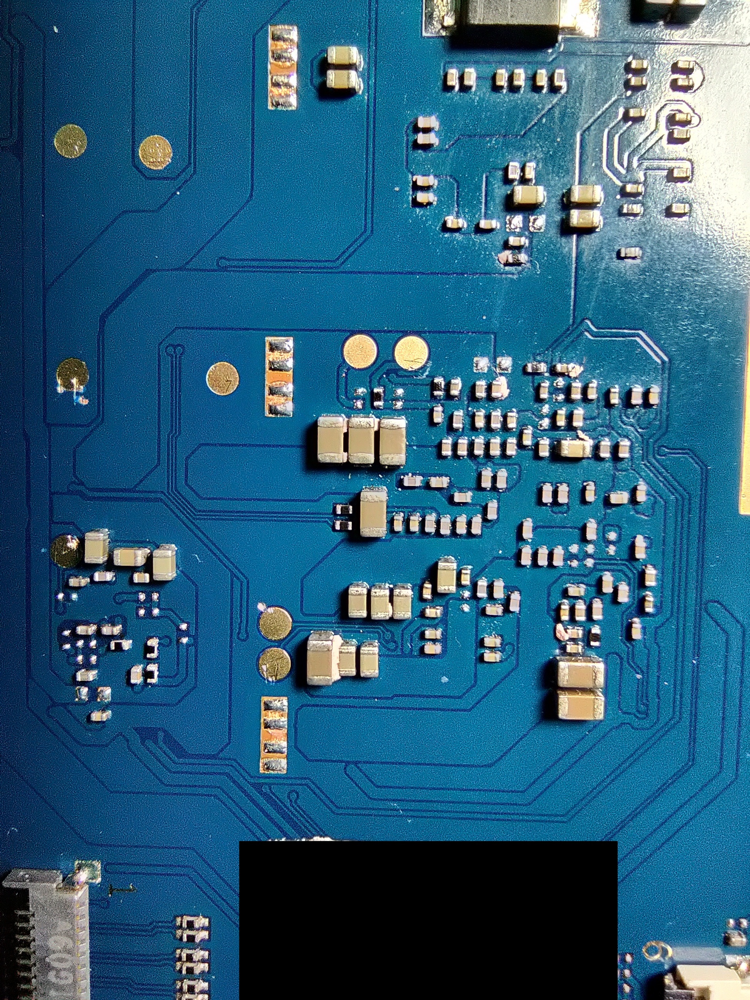
**Back, full board.** Dense SMD power-delivery section opposite the SoC. (Factory
QC label at bottom edge redacted.)

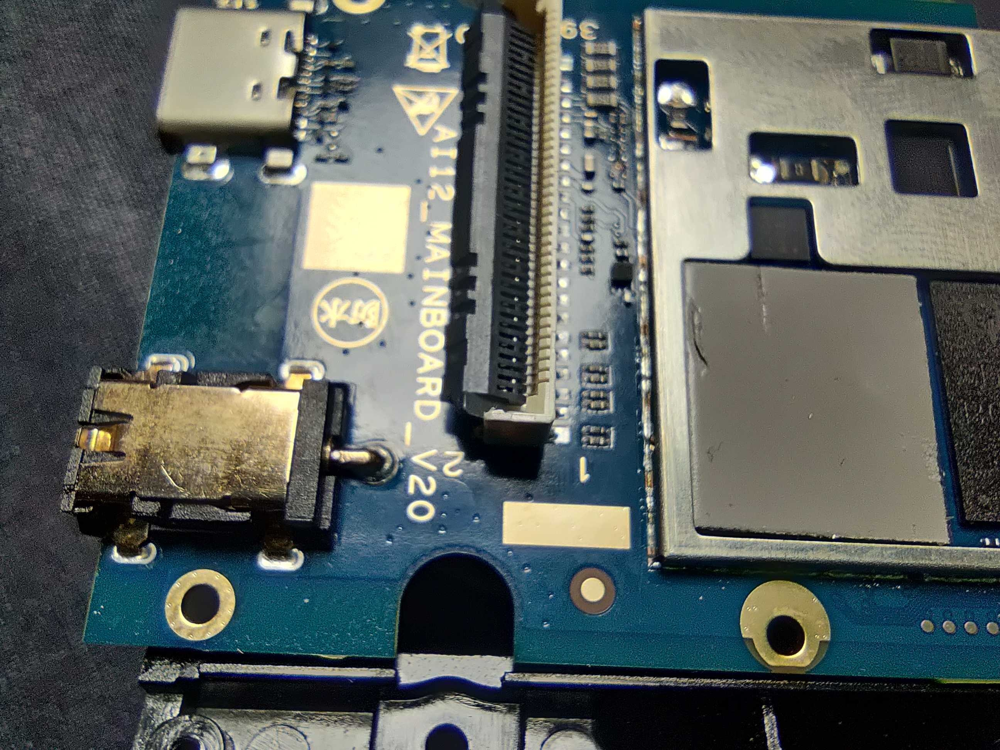
**Board ID silkscreen:** `AI12_MAINBOARD-V20`, printed next to the USB-C connector —
direct physical confirmation of the platform identity.

## SoC / memory / PMIC identification

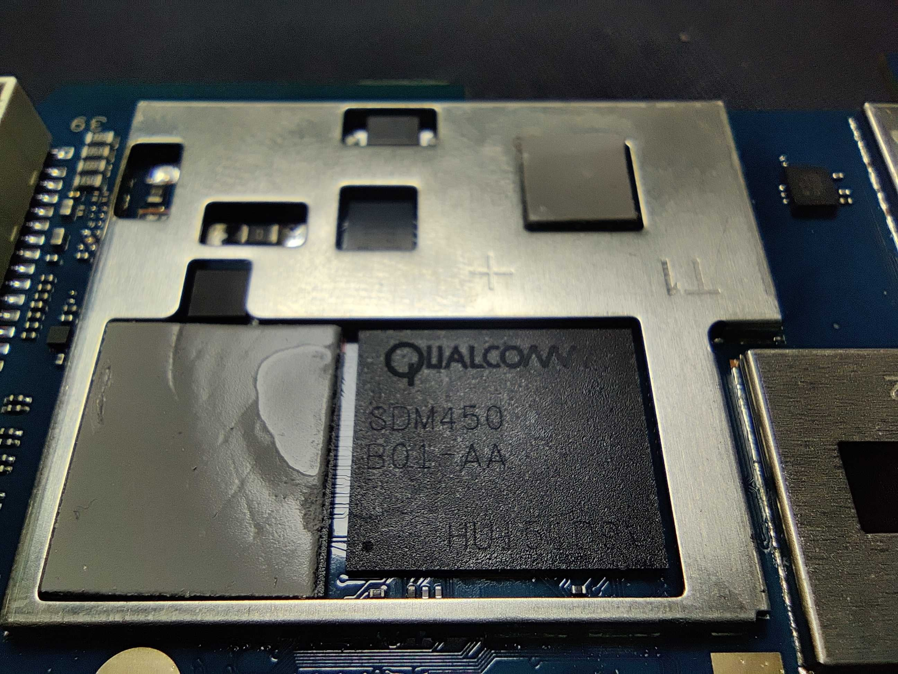
**Qualcomm SDM450 B01-AA**, sharpest available macro of the main SoC marking.

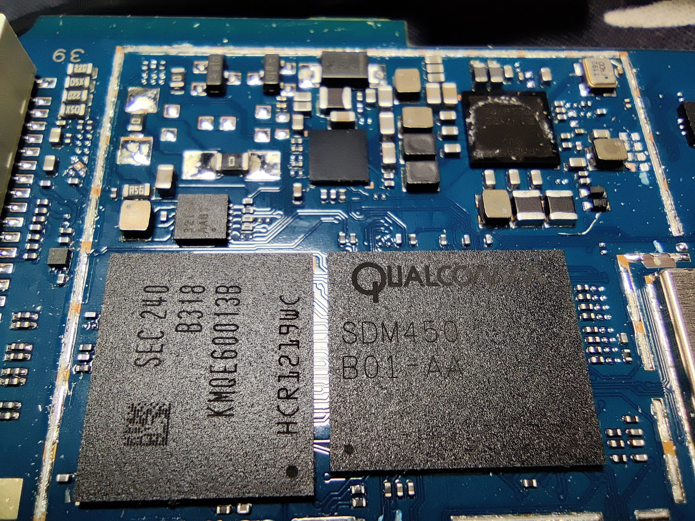
**SDM450 next to the Samsung `KMQE60013B` eMCP** (eMMC + 2 GB LPDDR3), wider context
shot showing the RF shield can removed.

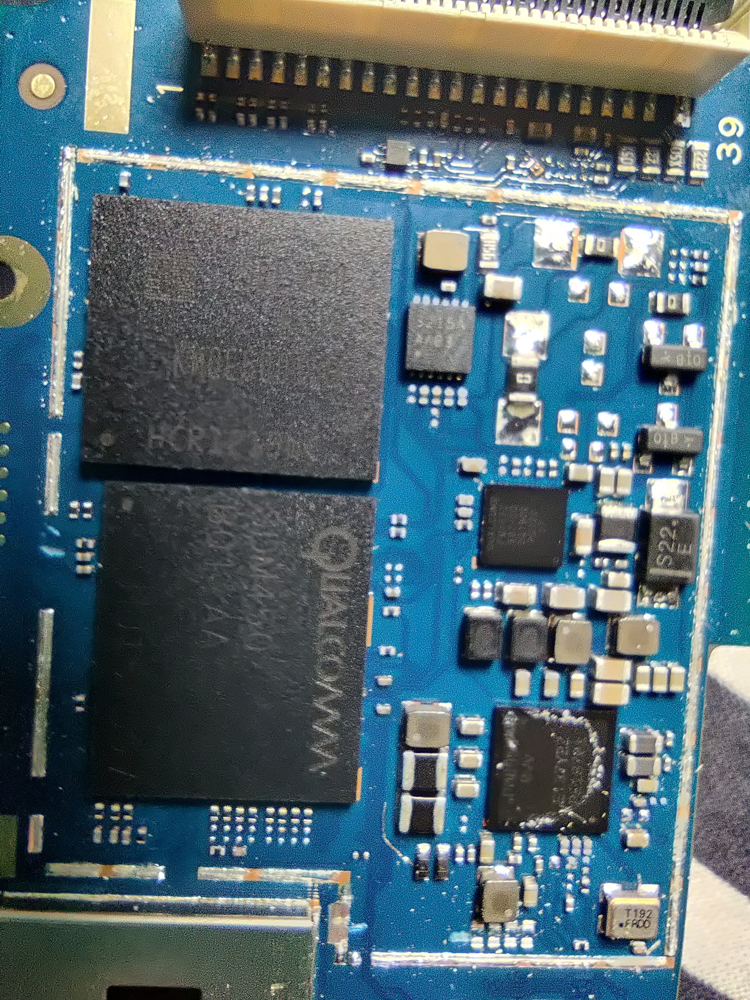
**Same die pair from a different angle**, with the PMIC and surrounding
power-management ICs visible top-right.

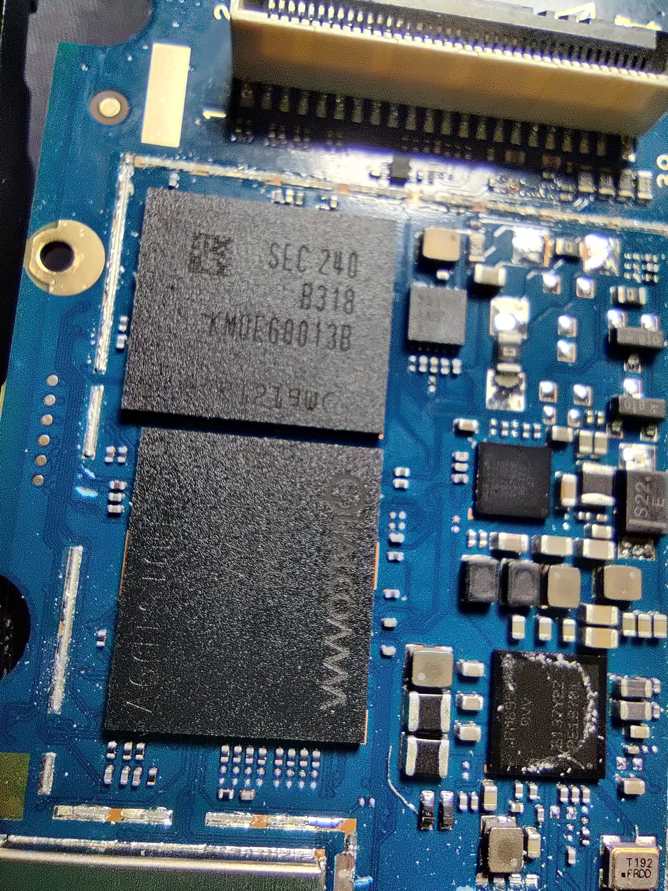
**Qualcomm PMI632** PMIC marking, legible next to the crystal (`T192`) and RF-shield
edge.

## Antenna, connectors, power

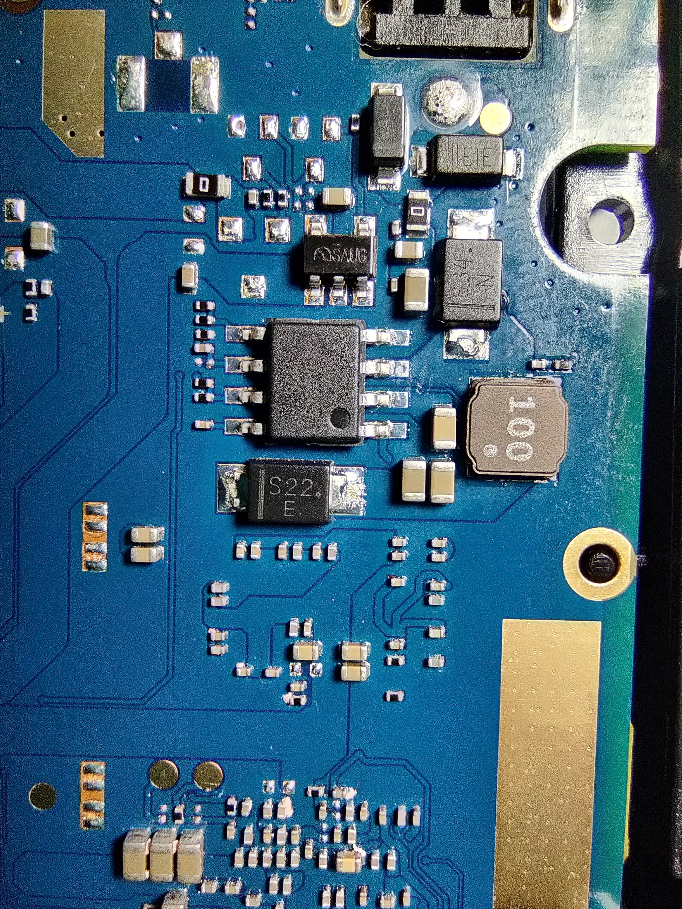
**Power-delivery cluster** on the back side — battery-charge IC, inductors, and
discrete FETs feeding the 5V/2A input path.

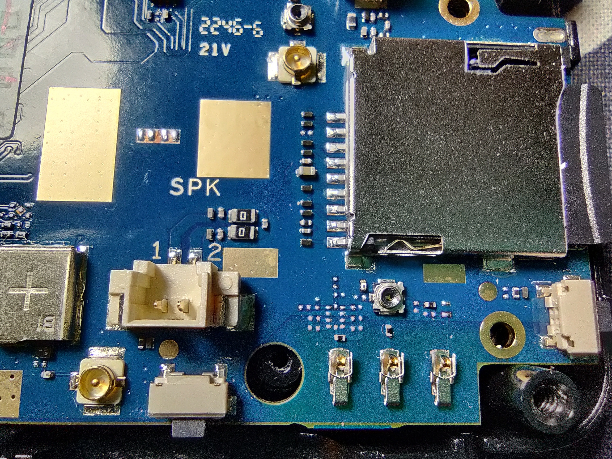
**microSD card slot, GNSS U.FL antenna port, and the internal LiPo backup-battery
connector** (silkscreened `BT +`) — the backup cell is the key finding behind
why an EDL cookie survives a cable pull (see the Power Architecture section of
the README).

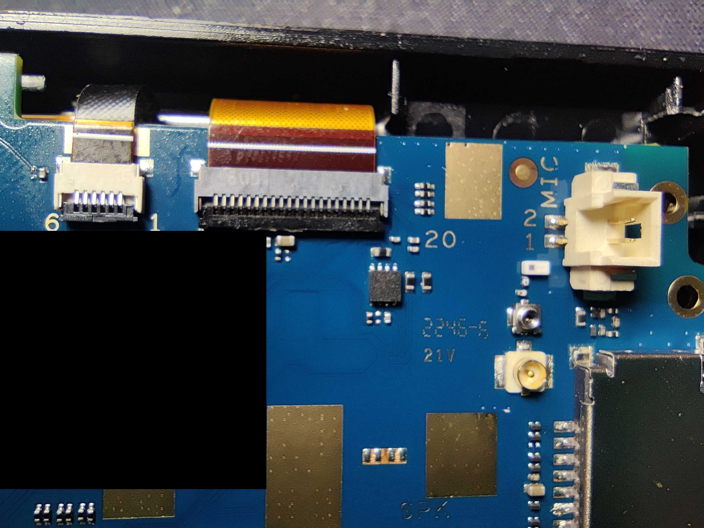
**MIC connector and U.FL GNSS antenna port**, next to the factory QC label
(redacted — pass/fail checkmarks only, serial blacked out).

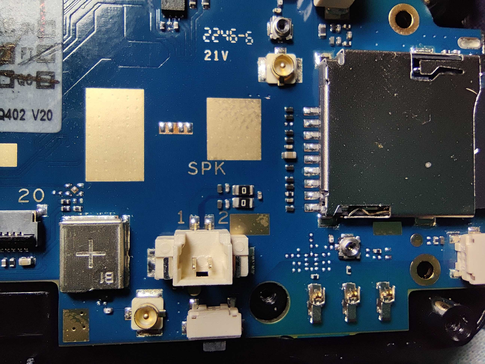
**Speaker pads, the internal LiPo backup-battery connector (`BT+`), and the SIM
card slot.**

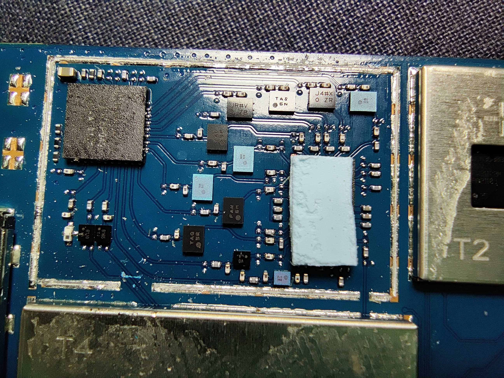
**RF shield can removed** over a secondary PMIC/RF section (silkscreened `T2`),
showing one of the shielded compartments on the board.
